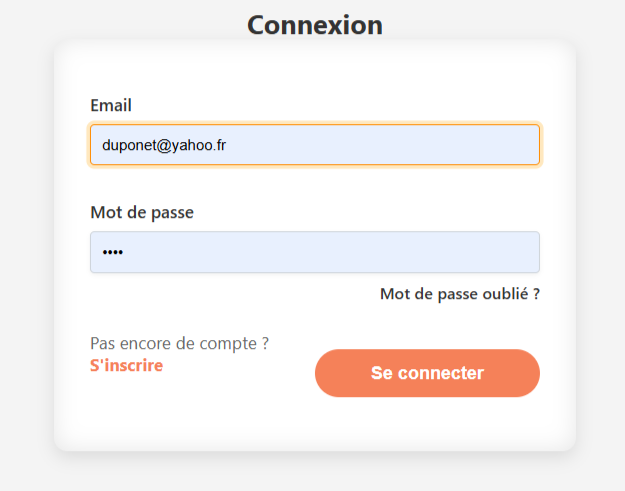
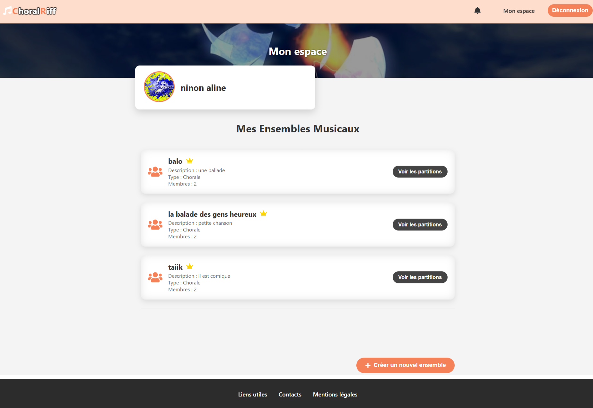
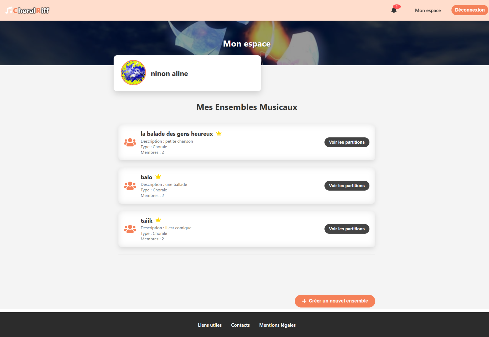
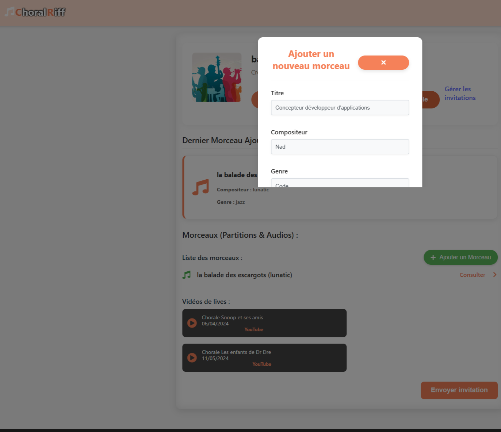
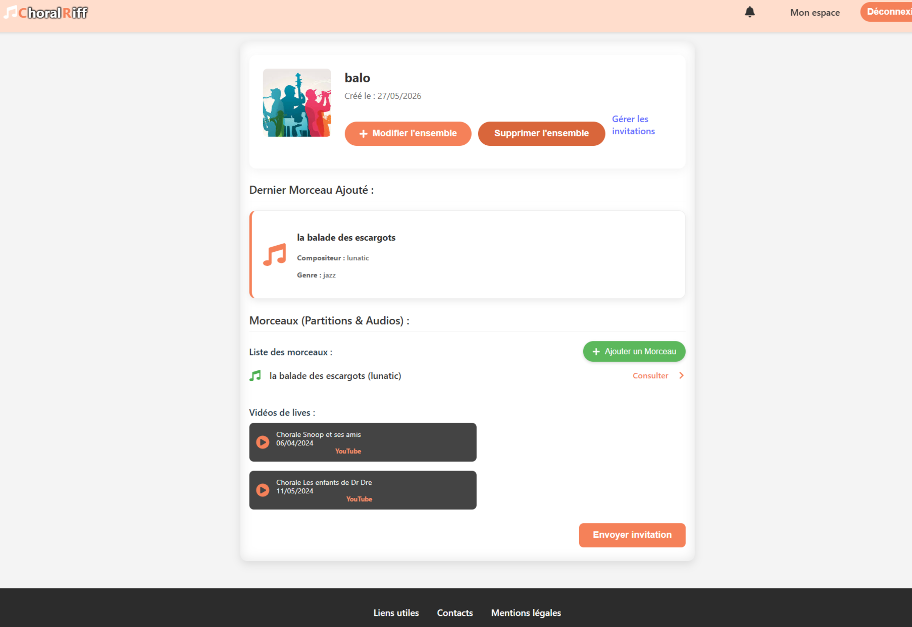
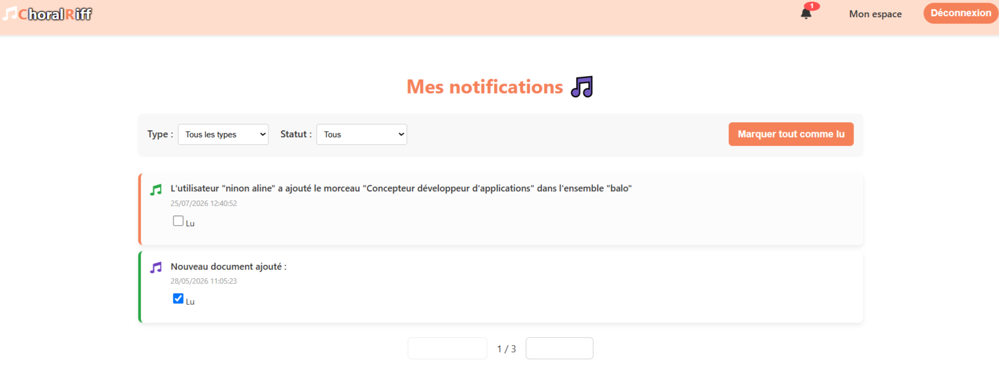
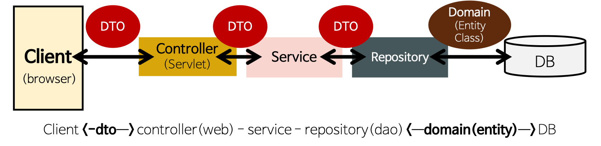
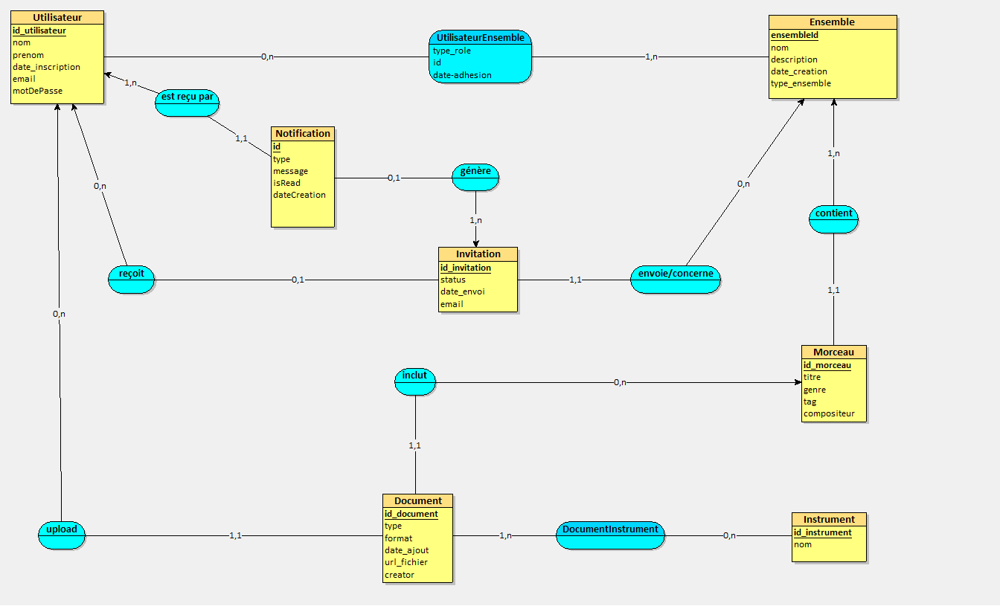
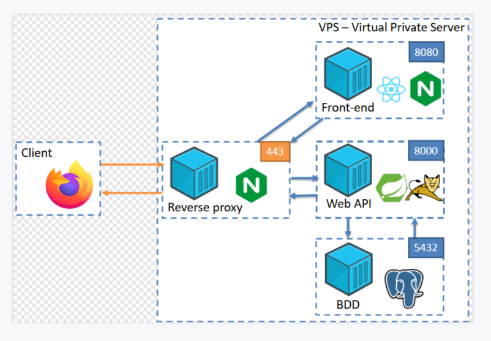

# Choral-Riff 🎵

## Présentation
**Application web full stack de gestion de ressources musicales pour chorales et ensembles**

Choral-Riff est une application métier permettant aux chorales, groupes vocaux et ensembles musicaux de centraliser leurs partitions, fichiers audio et ressources associées.

Le projet répond à un besoin concret : faciliter l'organisation et le partage des documents musicaux d'une chorale d'environ 60 membres répartis en plusieurs pupitres, tout en garantissant une gestion sécurisée des accès selon les rôles des utilisateurs.


---

# Sommaire

- [Présentation](#présentation)
- [Aperçu de l'application](#aperçu-de-lapplication)
- [Objectifs du projet](#objectifs-du-projet)
- [Fonctionnalités](#fonctionnalités)
- [Architecture du projet](#architecture-du-projet)
- [Modèle de données](#modèle-de-données)
- [Architecture de déploiement](#architecture-de-déploiement)
- [Réalisations techniques](#réalisations-techniques)
- [Sécurité](#sécurité)
- [Installation](#installation)
- [Organisation du dépôt](#organisation-du-dépôt)
- [Contexte du projet](#contexte-du-projet)
- [Évolutions possibles](#évolutions-possibles)

## Aperçu de l'application

## Connexion




## Tableau de bord



## Gestion des ensembles



## Gestion des morceaux





## Notifications



## Objectifs du projet

- Centraliser les partitions musicales et ressources associées
- Faciliter le partage entre les membres d'un ensemble
- Organiser les documents par morceau, ensemble et pupitre
- Gérer les utilisateurs, rôles et permissions
- Sécuriser l'accès aux ressources selon les droits attribués

---

## Fonctionnalités

## Gestion des utilisateurs

- Inscription et connexion sécurisée
- Authentification par email et mot de passe
- Gestion des rôles :
  - ADMIN
  - OWNER
  - MEMBER
- Gestion des permissions selon les profils utilisateurs

## Gestion des ensembles musicaux

- Création d'un ensemble musical
- Ajout et gestion des membres
- Organisation des utilisateurs par pupitre
- Attribution de responsabilités (chef de chœur / responsable)

## Gestion des morceaux

- Création de fiches morceaux
- Association des morceaux aux ensembles
- Gestion des partitions et ressources liées
- Association aux instruments ou pupitres concernés

## Gestion des documents

- Upload de fichiers :
  - PDF
  - Images
  - Fichiers audio
  - Vidéos
- Consultation des ressources musicales
- Lecture des fichiers audio
- Suppression des documents selon les droits utilisateur

---
## Gestion des notifications

- Création de notifications liées aux événements métier
- Information des utilisateurs lors d'actions importantes :
  - Ajout d'un membre dans un ensemble
  - Ajout de nouveaux morceaux ou documents
  - Mise à disposition de nouvelles ressources
- Consultation des notifications par les utilisateurs
- Stockage et gestion des notifications en base de données

## Architecture du projet

L'application est composée de deux parties :

```text
Choral-Riff

├── Choral-Riff-Backend
│   └── API REST Spring Boot
│
└── Choral-Riff-Frontend
    └── Interface React
```

### Architecture applicative

L'application suit une architecture en couches permettant de séparer les responsabilités entre l'interface utilisateur, la logique métier et l'accès aux données.


## Modèle de données

La conception de la base de données a été réalisée à partir d'un modèle conceptuel de données (MCD).

Le modèle permet de représenter les principales entités métier de l'application :

- Utilisateurs et gestion des profils
- Ensembles musicaux et adhésion des membres
- Morceaux et ressources associées
- Documents multimédias
- Notifications métier
- Invitations
- Instruments associés aux documents



## Architecture de déploiement

## Architecture de déploiement

L'application Choral-Riff peut être déployée sur une infrastructure serveur composée de plusieurs services conteneurisés.

L'architecture repose sur :

- Une interface frontend React
- Une API REST Spring Boot
- Une base de données PostgreSQL
- Un reverse proxy Nginx assurant l'accès HTTPS

Cette architecture permet :

- La séparation des responsabilités entre frontend, backend et base de données
- Une meilleure isolation des composants grâce à la conteneurisation Docker
- La sécurisation des échanges via HTTPS


## Réalisations techniques

Dans le cadre de ce projet :

- La conception d'une application métier complète en architecture MVC
- Le développement d'une API REST avec Spring Boot
- La création de 25 endpoints REST pour gérer les fonctionnalités métier
- La mise en place d'une authentification sécurisée
- La gestion des rôles et permissions avec un système RBAC (Role-Based Access Control)
- La gestion des autorisations selon les rôles : ADMIN, OWNER et MEMBER
- La modélisation et l'exploitation d'une base PostgreSQL
- Le développement d'une interface React connectée au backend
- La gestion des fichiers multimédias (partitions, audio, documents)
- La conception d'un système de notifications métier intégré à l'application
- L'écriture de tests unitaires et tests d'intégration
- La conteneurisation de l'application avec Docker
- Le versionnement du projet avec Git
- La mise en place d'un workflow CI avec GitHub Actions pour automatiser les builds et les tests

## Backend

- Java 21
- Spring Boot
- Spring Security
- API REST
- JPA / Hibernate

## Frontend

- React
- JavaScript / TypeScript
- Vite

## Base de données

- PostgreSQL

## Outils

- Git
- GitHub
- GitHub Actions
- Docker
- Maven

---
## Intégration continue

Le projet utilise GitHub Actions afin d'automatiser :

- La compilation du backend Spring Boot
- L'exécution des tests automatisés
- Le démarrage d'une base PostgreSQL dédiée aux tests
- La vérification de la connexion à la base de données
- La génération des rapports de tests en cas d'échec

## Sécurité

L'application intègre plusieurs mécanismes de sécurité :

- Authentification utilisateur
- Mots de passe hashés
- Gestion des rôles et permissions
- Contrôle d'accès aux ressources
- Protection contre les injections SQL

---

## Installation

## Prérequis

- Java 21
- Node.js
- PostgreSQL
- Maven

---

# Installation du frontend

```bash
cd Choral-Riff-Frontend

npm install

npm run dev
```

---

# Installation du backend

```bash
cd Choral-Riff-Backend

./mvnw spring-boot:run
```

---

# Utilisation avec Dev Container

Ouvrir le projet dans VS Code puis sélectionner :

```
Reopen in Container
```

Puis lancer :

```bash
./mvnw spring-boot:run
```

---

## Organisation du dépôt

```text
Choral-Riff

├── Choral-Riff-Backend
│
├── Choral-Riff-Frontend
│
└── document
    └── Documentation projet
```

---

## Contexte du projet

Projet réalisé dans le cadre du titre professionnel :

**Concepteur Développeur d'Applications (CDA)**

Ce projet a permis de mettre en pratique :

- La conception d'une application métier complète
- Le développement backend Java / Spring Boot
- La création d'une API REST
- La gestion d'une base de données relationnelle
- Le développement d'une interface React
- La mise en place de mécanismes de sécurité
- La gestion de projet avec Git

---

## Évolutions possibles

Quelques pistes d'amélioration :

- Ajout d'un rôle MODÉRATEUR avec des permissions intermédiaires
- Mise en place de notifications temps réel avec WebSocket
- Recherche avancée dans les partitions et documents
- Ajout d'un système de favoris pour les morceaux
- Gestion d'un calendrier des répétitions et événements
- Historique des modifications sur les documents
- Amélioration du tableau de bord avec des statistiques d'utilisation
- Déploiement de l'application sur une infrastructure cloud
